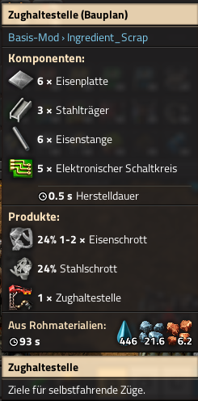
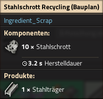
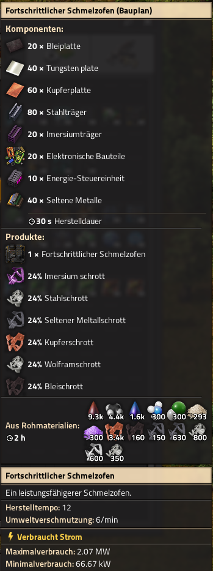

# A small Mod for Factorio built around Scrap.

It inserts its data in the data-final-fixes stage.
Affected are only "vanilla-names" (iron, copper, steel).
There are a few mods supported like KR2, IR2 and all (April 2022) bz-mods.
If you want to add scrap for other mods recipes then just edit mods.lua in which you can set like patterns and technologies.

|example recipes|mods recipes|
|:-:|-|
| ||

## Customize
The ``_types`` table holds the patterns and is used to match parts of a recipe name with string.find().
So iron will match iron-plate and hardenend-iron-plate. Even superironbar would be a match.
To exclude like copper-plate but still use copper-cables just be more specific. It is also used
to contruct the scrap-items like ``iron-scrap`` and the recycle recipes like ``recycle-iron-scrap``.

<pre lang=lua> local _types = {"iron", "copper", "steel"} </pre>

This table holds the result suffix which is then be constructed to ``_types.."-".._results`` (eg iron-plate).
Like the \_types table, this one also goes by priority, so index 1 is taken if possible, if not 2 will be checked etc.
When no match is found then the recipe will be ignored and it is also logged.
As there will be no recycling of this scrap-item _plate_ is added to the end as some sort of fallback.

<pre lang=lua> local _results = {"plate"} </pre>

## Known Issues
* doesn't work if the item name is in 'reverse' order like plates-osmium instead of osmium-plate
* a recipe is enabled if no technology which unlocks the result can be found instead of checking the enabled keys
* scrap colors doesn't fit quite frequently because i didn't implement a tint based icon system, shame on me
* the scrap icons look awful

## Languages
* english
* deutsch

## How to contribute?
Please use the Issues Tab and share your suggestions and/or code.
