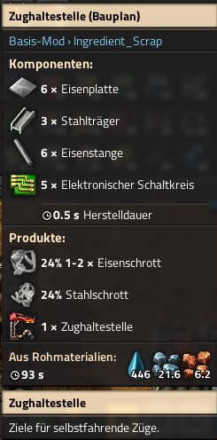
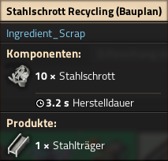
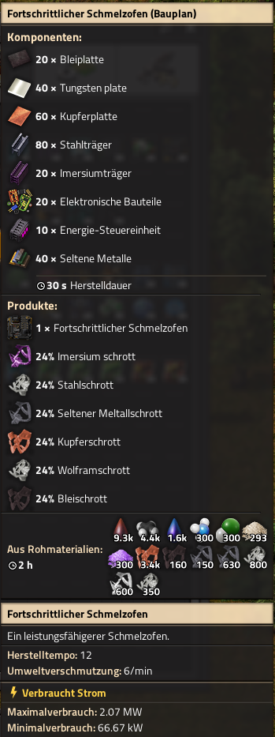

# Ingredient Scrap

Ingredient Scrap adds scrap byproducts to recipes based on their ingredients.
The generated scrap can be recycled back into the matching source material.

| Example recipes | Modded recipes |
| :-: | :-: |
| <br> |  |

The mod is built for Factorio 2.0 and runs its generation logic during the
data stage. It collects solid and fluid material families, generates scrap
items, recycle recipes, and unlock technologies, then patches matching recipes
with additional scrap results.

## Current behavior

- Detects solid materials from resources, known item suffixes, and explicit whitelists.
- Detects fluid material families such as `molten-*` and `liquid-*` when fluid support is enabled.
- Generates scrap items like `iron-scrap` or `testium-scrap`.
- Generates recycle recipes like `recycle-iron-scrap`.
- Generates fluid recycle recipes like `recycle-testium-scrap-to-fluid` when applicable.
- Adds scrap results to recipes based on matching solid and fluid ingredients.
- Accumulates mixed solid/fluid inputs into one scrap result per scrap type.
- Copies the source recipe `main_product` into the patch table before applying result inserts.
- Validates generated prototypes before calling `data:extend`, so invalid generated objects can be reported before Factorio rejects them.

## Settings

Startup settings are defined in `settings.lua`.

| Setting | Default | Description |
| --- | ---: | --- |
| `yis-needed` | `5` | Base amount of scrap needed by generated recycle recipes. |
| `yis-probability` | `24` | Scrap probability in percent. |
| `yis-fixed-amount` | `false` | Uses fixed `amount` instead of `amount_min`/`amount_max`. |
| `yis-amount-limit` | `true` | Keeps generated amounts smoothed instead of scaling large recipes linearly. |
| `yis-fluid-recipes` | `true` | Hidden setting; fluid handling is currently forced on in `data-updates.lua`. |

## Project layout

| Path | Purpose |
| --- | --- |
| `data.lua` | Registers categories, loads debug fixtures when `IS_DEBUG` is enabled. |
| `data-updates.lua` | Initializes settings and the shared data table, then runs collection/generation/patching. |
| `data-final-fixes.lua` | Builds debug test and data-table dumps as `mod-data`. |
| `control.lua` | Writes debug reports to `script-output` when a temporary game is created. |
| `core/materials.lua` | Collects solid and fluid material families. |
| `core/collector.lua` | Scans recipes and queues scrap result inserts and generated prototypes. |
| `core/patcher.lua` | Validates and applies generated prototypes and recipe patches. |
| `lib/generator.lua` | Builds scrap items, recycle recipes, technologies, and scrap result entries. |
| `lib/utils.lua` | Shared helpers for scrap amounts, names, icon layers, and import locations. |
| `lib/item-tints.lua` | Scrap tint definitions. Hex color codes are intentionally kept for VS Code color previews. |

## Debug and tests

The current test harness runs inside Factorio instead of parsing the Factorio log.

When `IS_DEBUG = true` in `data.lua`:

- `test/test-data.lua` creates synthetic `testium` fixtures.
- `test/runner.lua` compares normalized expected objects against `data.raw` and `yokmods.ingredient_scrap.data_table`.
- `data-final-fixes.lua` stores the report and data-table dump as `mod-data`.
- `control.lua` writes the files into `script-output/Ingredient_Scrap`.

Generated runtime files:

| File | Description |
| --- | --- |
| `script-output/Ingredient_Scrap/test-report.json` | Machine-readable test report. |
| `script-output/Ingredient_Scrap/data-table.lua` | Lua dump of `yokmods.ingredient_scrap.data_table` for manual inspection. |

Run one profile:

```powershell
python test\run_tests.py --profile default
```

Run all standard profiles:

```powershell
python test\run_tests.py --all
```

Keep temporary saves for debugging:

```powershell
python test\run_tests.py --profile default --keep-saves
```

By default, temporary saves under `test/tmp` are removed after the run.

### Test profiles

`test/run_tests.py --all` runs:

- `default`
- `fixed_amount`
- `limit_off`
- `probability_zero`
- `probability_full`
- `needed_min`
- `needed_high`
- `toggles_off`

### Active test files

| File | Purpose |
| --- | --- |
| `test/run_tests.py` | Starts Factorio, creates temporary saves, reads and prints the JSON report. |
| `test/test-data.lua` | Defines synthetic test prototypes. |
| `test/expected.lua` | Builds expected normalized objects for the current profile. |
| `test/runner.lua` | Runs data-stage assertions and returns the report. |

Older Python/log-parsing test files are no longer part of the current harness.

## VS Code / LuaLS support

The local Factorio documentation can be converted into LuaLS annotations for
autocomplete, hover text, and type navigation.

Source documentation:

```text
F:\Games\Factorio_ModTest\doc-html\prototype-api.json
F:\Games\Factorio_ModTest\doc-html\runtime-api.json
```

Generate editor annotations:

```powershell
python tools\generate_factorio_luals.py
```

Generated files:

| File | Description |
| --- | --- |
| `.vscode/factorio-types/factorio-prototype.lua` | Prototype/data-stage annotations. |
| `.vscode/factorio-types/factorio-runtime.lua` | Runtime/control-stage annotations. |
| `.luarc.json` | LuaLS configuration that adds the generated files as a workspace library. |

The raw JSON files cannot be used directly by LuaLS. The generator converts them
into `---@class`, `---@field`, `---@param`, and `---@type` comments that the Lua
language server understands.

## Development notes

- Keep generated prototype changes staged in `yokmods.ingredient_scrap.data_table` until validation has run.
- `data_table.inserts.recipes[recipe_name].main_product` should contain the source recipe main product whenever the patcher adds results to an existing recipe.
- Fluid ingredients use their fluid name as the recycle result, but a matching item such as `<scrap_type>-plate`, `<scrap_type>-ingot`, or `<scrap_type>` is used as the scrap item's visual and stack-size source.
- Do not rely on Factorio log parsing for tests; use `test-report.json`.

## Languages

- English
- Deutsch

## Contributing

Please use GitHub issues or pull requests for bug reports, ideas, and code
changes.
