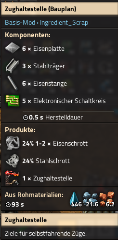
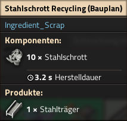
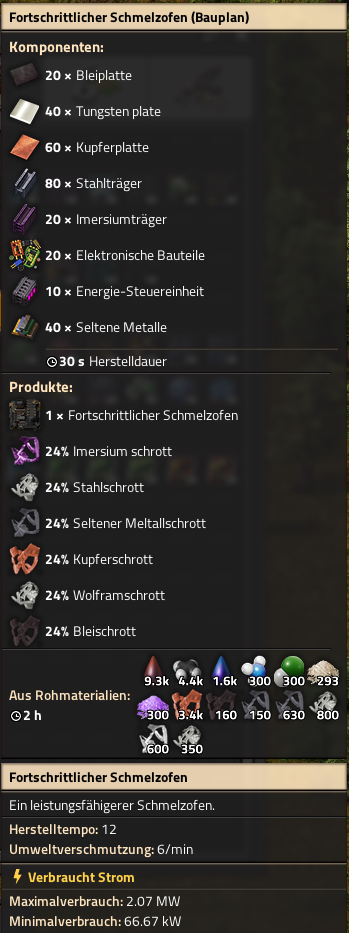

# Ingredient Scrap

Ingredient Scrap adds scrap byproducts to recipes based on their ingredients.
The generated scrap can be recycled back into the matching source material.

| Example recipes | Modded recipes |
| :-: | :-: |
| <br> |  |

The mod is built for Factorio 2.0 and runs its generation logic during the
data stage. It collects solid and fluid material families, generates scrap
items, recycle recipes, and unlock technologies, then patches matching recipes
with additional scrap results.

## Current behavior

- Detects solid materials from resources, known item suffixes, exact aliases,
  and explicit material registrations.
- Detects fluid material families such as `molten-*`, `liquid-*`,
  `*-solution`, and `*-brine` when they can be mapped to a known material.
- Generates scrap items like `yis-iron-scrap` or `yis-testium-scrap`.
- Generates recycle recipes like `yis-recycle-iron-scrap`.
- Generates fluid recycle recipes like `yis-recycle-testium-scrap-to-fluid`
  when a fluid ingredient maps back to a material.
- Keeps generated recycle recipes present and does not disable them with
  `enabled = false`; recipes that should not be visible yet are hidden with
  `hidden = true` instead.
- Adds scrap results to recipes based on matching solid and fluid ingredients.
- Accumulates mixed solid/fluid inputs into one scrap result per scrap type.
- Can trace component ingredients back to material families and collapse broad
  or unresolved chains into `yis-mixed-scrap`.
- Uses a weighted `yis-recycle-mixed-scrap` recipe when mixed scrap exists.
  The total output chance stays close to Space Age scrap at 60%, with common
  material scraps weighted higher than rare ones.
- Copies the source recipe `main_product` into the patch table before applying result inserts.
- Validates generated prototypes before calling `data:extend`, so invalid generated objects can be reported before Factorio rejects them.

## Ancestry and Mixed Scrap

Ingredient Scrap first creates a baseline from direct recipe ingredients. The
active ancestry resolver can then follow component recipes backwards, so a gear,
pipe, cable, bearing, or circuit can produce scrap for the material families it
is made from instead of always becoming its own component scrap.

The ancestry mode changes what the player tends to see:

| Mode | Gameplay result |
| --- | --- |
| `component-heavy` | Keeps more component scrap. This is closest to the direct ingredient scan and creates fewer broad material rewrites. |
| `balanced` | Default. Resolves common components back to materials, but keeps complex or too-wide chains as mixed scrap. |
| `material-heavy` | Tries harder to reduce components into base materials. This can create more material scrap and less component scrap. |

`yis-mixed-scrap` is the fallback for chains that become too wide, unresolved, or
unsafe to reduce into one clear material family. Mixed amounts use conservative
`floor` rounding with a minimum of 1, so the fallback does not inflate large
recipes as aggressively as a rounded-up estimate would.

Recycling `yis-mixed-scrap` behaves like a sorting process. The generated
`yis-recycle-mixed-scrap` recipe contains the scrap families that are actually
present in the current mod set. Their probabilities are weighted by expected
scrap frequency from patched source recipes:

- total output chance is about 60%;
- the most common target is about 20%;
- rarer targets stay in the pool with lower probabilities.

## Fluid Handling

Fluid support is intentionally narrower than solid material support. Ingredient
Scrap does not create fluid scrap prototypes. A matched fluid ingredient still
creates normal item scrap, such as `yis-iron-scrap`, and may also create a
`-to-fluid` recycle recipe that turns that scrap back into the matched fluid.

For example, a recipe that consumes `molten-iron` can produce `yis-iron-scrap`,
and Ingredient Scrap can stage `yis-recycle-iron-scrap-to-fluid` with
`molten-iron` as the result. The scrap item itself uses a matching solid item,
such as `iron-plate`, `iron-bar`, or `iron-ingot`, as its visual and stack-size
source.

Fluid matching currently uses registered prefixes, suffixes, and exact aliases.
It covers common names like `molten-*`, `liquid-*`, `*-solution`, and
`*-brine`, plus compat-specific registrations. It does not try to solve full
chemistry chains, preserve chemical byproducts, or balance acids, gases, and
slurries as a separate system. Those cases are intentionally left for future
compat work or a dedicated extension mod.

## Recycler Scrap Sink

When the Quality DLC is active, Ingredient Scrap adds item recycling recipes to
compatible recycler-style machines. This intentionally lets the Quality
recycler process scrap again. Because the recycler applies its own recycling
yield, scrap can be reduced into a smaller amount of scrap instead of being
converted back into a full material.

This is intentional gameplay behavior, not a bug. It provides a late-game sink
for excess scrap while keeping normal scrap-to-material recycling recipes
available in other compatible machines.

## Settings

Startup settings are defined in `settings.lua`.

| Setting | Default | Description |
| --- | ---: | --- |
| `yis-needed` | `5` | Base amount of scrap needed by generated recycle recipes. |
| `yis-probability` | `24` | Scrap probability in percent. |
| `yis-fixed-amount` | `false` | Uses fixed `amount` instead of `amount_min`/`amount_max`. |
| `yis-amount-limit` | `true` | Keeps generated amounts smoothed instead of scaling large recipes linearly. |
| `yis-shallow-log` | `true` | Writes short generation summaries to the Factorio log. |
| `yis-hide-tech` | `true` | Hides generated recycling technologies unless shallow logging is enabled. |
| `yis-ancestry-mode` | `balanced` | Preset for component-heavy, balanced, or material-heavy scrap resolution. |
| `yis-ancestry-max-depth` | `8` | Maximum recipe-chain depth used when resolving components back to material families. |
| `yis-ancestry-mixed-limit` | `3` | Maximum number of resolved material families before a component falls back to mixed scrap. |
| `yis-material-*` | varies | Per-material override mode: `auto`, `solid`, `fluid`, `both`, or `none`. |

Fluid handling is currently always enabled. The old `yis-fluid-recipes` startup
setting remains hidden as an internal compatibility switch while solid/fluid
separation is revisited.

## Compatibility Status

| Mod set | Status | Notes |
| --- | --- | --- |
| Base game | Supported | Main reference target for normal material scrap and recycling. |
| Space Age | Supported | Adds fluid and advanced material cases such as molten metals, holmium, lithium, and tungsten chains. |
| Quality | Supported | The recycler can act as a scrap sink; this is intentional. |
| Krastorio 2 | Tested | Uses explicit compat rules where the automatic resolver cannot infer the intended target safely. |
| Bob's Mods | Tested | Large component and alloy chains are supported through compat aliases and mixed-scrap fallback. |
| Angel's Mods | Tested | Complex refining, chemistry, and metallurgy can create mixed scrap or require explicit compat rules. |
| Bob + Angels together | Tested | This is the broad stress profile. Some very complex chains intentionally fall back to mixed scrap. |

Chemistry-specific balancing and Preserve Recipe Shape are not part of the
current release behavior. The current goal is stable ingredient scrap generation
with explicit compat hooks for known exceptions.

## Public API

Ingredient Scrap exposes a small settings/data-stage API through
`yokmods.ingredient_scrap.api`. Vanilla, Space Age, Quality, and built-in compat
modules use the same API that other mods can use.

API modules publish their functions when they are required:

| API module | Purpose |
| --- | --- |
| `code.lib.material-overrides` | Material modes, prototype aliases, affixes, setting icons, and scrap tints. |
| `code.lib.category-overrides` | Crafting category support for furnaces and assembling machines. |
| `code.lib.recipe-chain-overrides` | Explicit recycle target overrides for recipe-chain decisions. |
| `code.lib.source-overrides` | Rules that prevent selected source recipes from receiving scrap byproducts. |

Registrations that should affect material settings must run during Factorio's
settings stage. Registrations that should affect collection, generated scrap, or
crafting categories must run before Ingredient Scrap reaches its collection pass
in `data-updates.lua`. Later stages can still inspect and patch generated
prototypes through `api.generated`, but they cannot create new startup settings
for that load.

### Material API

Material overrides generate per-material startup settings and decide whether a
material is handled as solid, fluid, both, or ignored. Register known materials
during the settings stage when you want the generated startup setting to exist in
the same load:

```lua
require("__Ingredient_Scrap__.code.lib.material-overrides")

local api = yokmods.ingredient_scrap.api

api.register.material.both("rare-metal", {
  localized_setting_name = true,
  source = { name = "Example Mod", color = "#78C850" },
  tint = "#8031A7",
  prototype_aliases = {
    item = { "example-rare-metals" },
  },
  prototype_affixes = {
    item = {
      prefixes = {},
      suffixes = { "-plate", "-ingot", "-ore", "" },
    },
    fluid = {
      prefixes = { "molten-", "liquid-" },
      suffixes = { "-solution", "-slurry" },
    },
  },
})
```

Convenience wrappers cover common cases:

```lua
api.register.material.auto("iron", options)
api.register.material.solid("steel", options)
api.register.material.fluid("dirty-water", options)
api.register.material.both("rare-metal", options)
api.register.material.tint("rare-metal", "#8031A7")
api.register.material.alias("rare-metal", "item", "example-rare-metals")
api.ignore.material("uranium", options)
```

Use the full override form for unusual cases:

```lua
api.register.material.override({
  name = "rare-metal",
  default = "both",
  localized_setting_name = true,
  source = { name = "Example Mod", color = "#78C850" },
  tint = "#8031A7",
  prototype_aliases = {
    item = { "example-rare-metals" },
    fluid = { "example-rare-metal-slurry" },
  },
  prototype_affixes = {
    item = {
      prefixes = {},
      suffixes = { "-plate", "-ingot", "-ore", "" },
    },
    fluid = {
      prefixes = { "molten-", "liquid-" },
      suffixes = { "-solution", "-slurry" },
    },
  },
})
```

Modes:

| Mode | Meaning |
| --- | --- |
| `auto` | Use normal material detection. |
| `solid` | Force solid handling and ignore fluid handling. |
| `fluid` | Force fluid handling and ignore solid handling. |
| `both` | Force both solid and fluid handling. |
| `none` | Ignore the material completely. |

`prototype_affixes` describe how real prototype names are built from the material
name. For `rare-metal`, the suffix `"-plate"` checks for `rare-metal-plate`,
while the prefix `"molten-"` checks for `molten-rare-metal`. These affixes are
also aggregated into the data-stage resolver. The core affix set intentionally
stays close to vanilla and Space Age, including fluid names such as
`lithium-brine`; mod-specific affixes such as `"-ingot"` or `"liquid-"` belong
in compat registrations.

`prototype_aliases` maps exact prototype names to a material when affixes are
not enough or would be too broad. This is useful for mods with names such as
`kr-rare-metals`, where treating `kr-` or plural `s` as a global affix would
create false positives. The direct wrapper
`api.register.material.alias(material, "item"|"fluid", prototype_name)` adds one
alias at a time.

Component-style materials can also be registered through exact aliases. This is
used by the built-in Bob/Angels compat for families such as gears, bearings,
balls, cables, circuits, boards, batteries, and pipes. Pipes are an intentional
placeable exception: most placeable entities are ignored as material candidates,
but pipe items behave like normal player-visible components and are expected to
produce scrap.

Set `exact_scrap = true` for broad component families where each matched source
prototype should keep its own scrap identity. For example, a `bearing` family can
still collect `bob-brass-bearing` and `bob-titanium-bearing`, but it will produce
`yis-bob-brass-bearing-scrap` and `yis-bob-titanium-bearing-scrap` instead of one
shared `yis-bearing-scrap`. The generated recycle recipe then returns the same
prototype that created the scrap.

`localized_setting_name = true` tells Ingredient Scrap to use
`mod-setting-name.yis-material-<name>` from the locale files as the icon part of
the generated startup setting. Locale entries should contain only the rich-text
icon, for example `[item=iron-plate]` or `[fluid=crude-oil]`; Ingredient Scrap
adds the material name and the generic "Material mode" text. If no localized
setting name is registered, Ingredient Scrap uses `[img=none]` as a neutral
fallback so the settings list stays aligned without showing broken rich-text
icons.

`tint` sets the generated scrap icon tint for the material. It accepts a
Factorio color table or a hex color string such as `"#8031A7"`.

`source` annotates the generated material startup setting description with the
mod or DLC that registered the material. It can be a plain string or a table
such as `{ name = "Krastorio 2", color = "#78C850" }`; the color is written as
rich text so related settings stand out in Factorio's settings UI.

Startup settings are generated during Factorio's settings stage. Data-stage-only
registrations can still affect later data-stage logic if they run before
Ingredient Scrap collects materials, but they cannot create new startup settings
for the same load.

### Generated Prototype Access

Generated prototype accessors are available after Ingredient Scrap has built its
data-stage tables. They return the staged tables by reference, so compat mods can
inspect or patch generated prototypes in a later data stage such as
`data-final-fixes.lua`:

```lua
local api = yokmods.ingredient_scrap.api

local items = api.generated.items()
local fluids = api.generated.fluids()
local recipes = api.generated.recipes()
local technologies = api.generated.technologies()
local techs = api.generated.techs()
```

`items`, `recipes`, and `technologies` point at the generated prototype tables
inside `yokmods.ingredient_scrap.data_table.prototypes`. `fluids` lists fluid
prototype names used as generated fluid recycle results; Ingredient Scrap does
not create new fluid prototypes.

Generated recycle recipes are kept present instead of being removed or disabled.
When Ingredient Scrap hides a generated prototype, another mod can reveal it by
clearing `hidden`:

```lua
local recipe = api.generated.recipes()["yis-recycle-example-scrap"]
if recipe then recipe.hidden = nil end
```

Ingredient Scrap also keeps a compatibility facade for common helper functions:

| Helper | Meaning |
| --- | --- |
| `yokmods.ingredient_scrap.get_scrap_name(material)` | Returns names such as `yis-iron-scrap`. |
| `yokmods.ingredient_scrap.get_recycle_recipe_name(material)` | Returns names such as `yis-recycle-iron-scrap`. |
| `yokmods.ingredient_scrap.scrap_amount_range(amount)` | Returns the generated fixed amount or min/max range for a source amount. |
| `yokmods.ingredient_scrap.is_log(source, level, step, description, details)` | Adds a structured Ingredient Scrap log entry and writes a concise Factorio log message. |

Internal code uses focused modules such as `code.lib.naming`,
`code.lib.scrap-amount`, `code.lib.icon-layers`, and `code.lib.is-log`; external
compat code can use the facade when that is simpler.

### Recipe-Chain Target API

Recipe-chain target support can be nudged explicitly when the automatic decider
does not have enough context. These hooks affect the passive analysis dump and,
when `yis-use-recipe-chain-targets` is enabled, the staged recycle target that
Ingredient Scrap applies:

```lua
require("__Ingredient_Scrap__.code.lib.recipe-chain-overrides")

local api = yokmods.ingredient_scrap.api

api.register.recipe_chain.solid.to_item("steel", "kr-steel-beam", {
  source = { name = "Example Compat", color = "#78C850" },
  reason = "this mod turns steel scrap back into beams",
})

api.register.recipe_chain.fluid.to_fluid("rare-metal", "rare-metal-solution", {
  source = "Example Compat",
})

api.ignore.recipe_chain.solid("unstable-material", "manual compat rule")
```

Use `api.register.recipe_chain.target(material, mode, result_type, result_name,
options)` for the full form. `mode` is `"solid"` or `"fluid"` and `result_type`
is `"item"` or `"fluid"`. The convenience wrappers keep the common cases
readable:

| Wrapper | Meaning |
| --- | --- |
| `api.register.recipe_chain.solid.to_item(material, result, options)` | Solid scrap recycles to an item. |
| `api.register.recipe_chain.solid.to_fluid(material, result, options)` | Solid scrap recycles to a fluid. |
| `api.register.recipe_chain.fluid.to_fluid(material, result, options)` | Fluid scrap recycles to a fluid. |
| `api.register.recipe_chain.fluid.to_item(material, result, options)` | Fluid scrap recycles to an item. |
| `api.ignore.recipe_chain.target(material, mode, reason)` | Block automatic target staging for one material/mode pair. |
| `api.ignore.recipe_chain.solid(material, reason)` | Block automatic solid target staging. |
| `api.ignore.recipe_chain.fluid(material, reason)` | Block automatic fluid target staging. |

### Source Filter API

Source filters decide whether an existing source recipe should receive scrap
byproducts at all. Use these when the recycle target is fine, but a recipe is
part of an ore-processing, slag, sorting, chemical, or other side chain where
Ingredient Scrap would be misleading:

```lua
require("__Ingredient_Scrap__.code.lib.source-overrides")

local api = yokmods.ingredient_scrap.api

api.ignore.source.recipe("example-ore-processing", {
  reason = "ore processing should produce slag, not Ingredient Scrap",
})

api.ignore.source.category("example-ore-processing-category", {
  ingredient_suffixes = { "-ore" },
  ingredient_exclude_prefixes = { "debug-" },
  reason = "ignore only ore inputs in this category",
})
```

`api.ignore.source.recipe(name, options)` blocks one recipe.
`api.ignore.source.category(category, options)` blocks matching inputs in one
recipe category.

Options can narrow the rule:

| Option | Meaning |
| --- | --- |
| `material` | Apply only while handling one material name. |
| `mode` | Apply only to `"solid"` or `"fluid"` source matching. |
| `ingredient_names` | Apply only to exact ingredient prototype names. |
| `ingredient_prefixes` | Apply only to ingredient names with one of these prefixes. |
| `ingredient_suffixes` | Apply only to ingredient names with one of these suffixes. |
| `ingredient_exclude_names` | Do not apply to exact ingredient prototype names. |
| `ingredient_exclude_prefixes` | Do not apply to ingredient names with one of these prefixes. |
| `ingredient_exclude_suffixes` | Do not apply to ingredient names with one of these suffixes. |
| `reason` | Human-readable compat note for dumps/logs. |

For example, the Bob+Angels compat keeps plate-to-alloy recipes scrap-producing
while filtering ore-to-processing chains by ignoring only `*-ore` ingredients in
known process categories. Rules are additive, so multiple recipe/category rules
can target the same key. Exclude filters are useful for local debug fixtures or
other exact exceptions that should keep producing scrap. In debug dumps, matched
source-filter skips are written to `material-flow.json` as `skipped_sources` so
compat rules can be audited without parsing `factorio-current.log`.

### Category API

Crafting category support is registered through the public API and is kept
separate by prototype type. Furnaces and assembling machines are intentionally
configured separately because different mod combinations may attach the same
crafting categories to very different machine types:

```lua
require("__Ingredient_Scrap__.code.lib.category-overrides")

local api = yokmods.ingredient_scrap.api

api.register.category.furnace({
  source_categories = { "smelting", "recycling" },
  add_item_recycling = true,
})

api.register.category.assembling_machine({
  source_categories = { "crafting", "crafting-with-fluid" },
  add_item_recycling = true,
  add_fluid_recycling_if_fluid_boxes = true,
})
```

`source_categories` may be a list or a set-like table. `add_item_recycling`
adds `yis-recycle-to-item`; `add_fluid_recycling_if_fluid_boxes` adds
`yis-recycle-to-fluid` only to assembling-machine prototypes with `fluid_boxes`.

### Compat Workflow

The intended compat workflow is layered:

1. Use material overrides and exact aliases for hard naming facts.
2. Use source filters when a recipe should not receive scrap byproducts.
3. Use recipe-chain targets when scrap should recycle to a different result.
4. Keep broad scoring or weight changes for later profiling tools.

Weight/profile tuning can fix systematic bias, for example when a mod generally
prefers beams over plates, keeps vanilla compatibility stubs hidden, or routes
ores through dust/ingot chains. It cannot reliably solve irregular naming,
singular/plural aliases, or deliberate gameplay exceptions. Those cases should
stay explicit through the API.

## Project layout

| Path | Purpose |
| --- | --- |
| `data.lua` | Registers recipe categories, applies the first crafting category pass, loads debug fixtures when `IS_DEBUG` is enabled. |
| `data-updates.lua` | Re-applies crafting category rules after other mods can modify machines, initializes settings and the shared data table, then runs collection/generation/patching. |
| `data-final-fixes.lua` | Builds debug test and data-table dumps as `mod-data`. |
| `control.lua` | Writes debug reports to `script-output` when a temporary game is created. |
| `code/core/materials.lua` | Collects solid and fluid material families. |
| `code/core/scrap-resolver.lua` | Orchestrates baseline collection and active ancestry rewrites. This is the main data-stage resolver entrypoint. |
| `code/core/baseline-collector.lua` | Baseline scanner that queues initial scrap result inserts and generated prototypes before ancestry can rewrite them. |
| `code/core/ancestry/` | Recipe-derived resolver modules for component ancestry, mixed scrap fallback, and active rewrites. |
| `code/core/recipe-chain-runner.lua` | Builds passive recipe-chain debug data and applies enabled high-confidence target decisions. |
| `code/core/prototype-builder.lua` | Builds scrap item, recycle recipe, and technology prototypes for resolver passes. |
| `code/core/patcher.lua` | Validates and applies generated prototypes and recipe patches. |
| `code/compat/vanilla-materials.lua` | Registers Base and Space Age material support through the public API. |
| `code/compat/vanilla-categories.lua` | Registers Base, Quality, and Space Age crafting category support through the public API. |
| `code/compat/mod-materials.lua` | Registers optional mod material and source overrides through the public API. |
| `code/lib/material-overrides.lua` | Public material registry and material setting helpers. |
| `code/lib/category-overrides.lua` | Public crafting category registry and duplicate-safe category helpers. |
| `code/lib/recipe-chain-overrides.lua` | Public recipe-chain target override registry. |
| `code/lib/startup-settings.lua` | Loads startup settings and debug test profiles into the shared settings table. |
| `code/lib/generated-api.lua` | Publishes public accessors for generated prototype staging tables. |
| `code/lib/utils.lua` | Public compatibility facade for commonly used Ingredient Scrap helpers. |
| `code/lib/naming.lua` | Internal name helpers for generated scrap items, recycle recipes, and import locations. |
| `code/lib/scrap-amount.lua` | Internal scrap amount and range calculation. |
| `code/lib/icon-layers.lua` | Internal recycle recipe and technology icon layer builder. |
| `code/lib/is-log.lua` | Internal structured logging helper used by resolver and patcher code. |
| `code/lib/item-tints.lua` | Scrap tint definitions. Hex color codes are intentionally kept for VS Code color previews. |

## Debug and tests

The current test harness runs inside Factorio instead of parsing the Factorio log.

When `IS_DEBUG = true` in `data.lua`:

- `tools/test/test-data.lua` creates synthetic `testium` fixtures.
- `tools/test/material-overrides.lua` registers synthetic materials through the public material override API.
- `tools/test/runner.lua` compares normalized expected objects against `data.raw` and `yokmods.ingredient_scrap.data_table`.
- `data-final-fixes.lua` stores the report and data-table dump as `mod-data`.
- `control.lua` writes the files into `script-output/Ingredient_Scrap`.

Generated runtime files:

| File | Description |
| --- | --- |
| `script-output/Ingredient_Scrap/test-report.json` | Machine-readable test report. |
| `script-output/Ingredient_Scrap/data-table.lua` | Lua dump of `yokmods.ingredient_scrap.data_table` for manual inspection. |

Run one profile:

```powershell
python tools\test\run_tests.py --profile default
```

Run all standard profiles:

```powershell
python tools\test\run_tests.py --all
```

Keep temporary saves for debugging:

```powershell
python tools\test\run_tests.py --profile default --keep-saves
```

By default, temporary saves under `tools/test/tmp` are removed after the run.

### Test profiles

`tools/test/run_tests.py --all` runs:

- `default`
- `fixed_amount`
- `limit_off`
- `probability_min`
- `probability_full`
- `needed_min`
- `needed_high`
- `toggles_off`

### Active test files

| File | Purpose |
| --- | --- |
| `tools/test/run_tests.py` | Starts Factorio, creates temporary saves, reads and prints the JSON report. |
| `tools/test/test-data.lua` | Defines synthetic test prototypes. |
| `tools/test/expected.lua` | Builds expected normalized objects for the current profile. |
| `tools/test/runner.lua` | Runs data-stage assertions and returns the report. |

Older Python/log-parsing test files are no longer part of the current harness.

## VS Code / LuaLS support

The local Factorio documentation can be converted into LuaLS annotations for
autocomplete, hover text, and type navigation.

Source documentation:

```text
F:\Games\Factorio_ModTest\doc-html\prototype-api.json
F:\Games\Factorio_ModTest\doc-html\runtime-api.json
```

Generate editor annotations:

```powershell
python tools\generate_factorio_luals.py
```

Generated files:

| File | Description |
| --- | --- |
| `.vscode/factorio-types/factorio-prototype.lua` | Prototype/data-stage annotations. |
| `.vscode/factorio-types/factorio-runtime.lua` | Runtime/control-stage annotations. |
| `.luarc.json` | LuaLS configuration that adds the generated files as a workspace library. |

The raw JSON files cannot be used directly by LuaLS. The generator converts them
into `---@class`, `---@field`, `---@param`, and `---@type` comments that the Lua
language server understands.

## Development notes

- Keep generated prototype changes staged in `yokmods.ingredient_scrap.data_table` until validation has run.
- `data_table.inserts.recipes[recipe_name].main_product` should contain the source recipe main product whenever the patcher adds results to an existing recipe.
- Fluid ingredients use their fluid name as the recycle result, but a matching item such as `<scrap_type>-plate`, `<scrap_type>-ingot`, or `<scrap_type>` is used as the scrap item's visual and stack-size source.
- Do not rely on Factorio log parsing for tests; use `test-report.json`.

## Languages

- English
- Deutsch

## Contributing

Please use GitHub issues or pull requests for bug reports, ideas, and code
changes.
